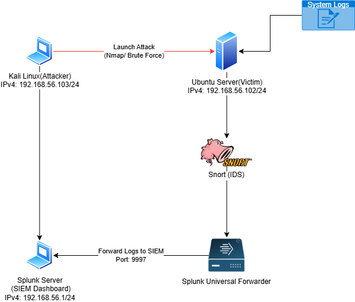
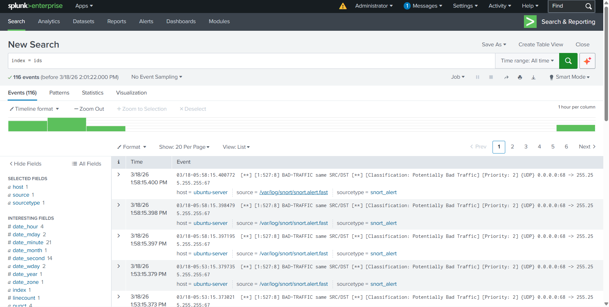
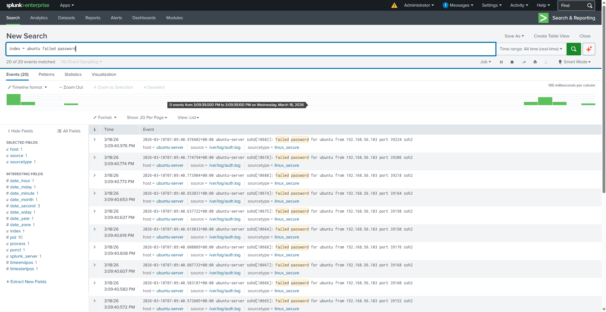
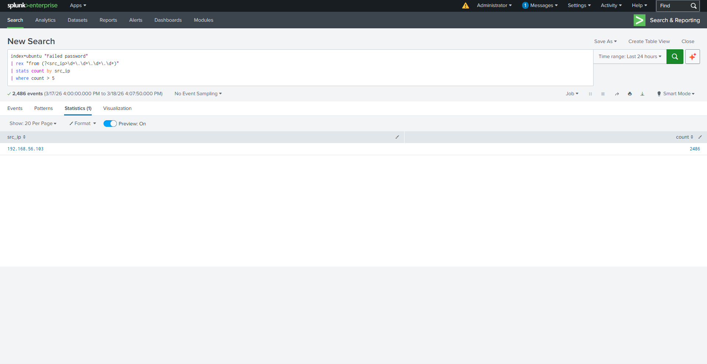

# SOC Home Lab – Security Monitoring Project

## Overview
This project simulates a small Security Operations Center (SOC) environment to demonstrate practical skills in system monitoring, intrusion detection, and log analysis. The lab integrates:

- **Kali Linux** – attacker machine  
- **Ubuntu Server** – victim machine  
- **Snort IDS** – intrusion detection  
- **Splunk SIEM** – log collection, visualization, and alerting  

The lab workflow demonstrates a full SOC process: **attack → detection → alerting → analysis**.

---

## Lab Architecture

```
Kali Linux (Attacker) ──▶ Ubuntu Server (Victim)
│
▼
Logs → Splunk SIEM (Windows Host)
│
▼
Snort IDS Alerts
```

- **Kali Linux:** used to simulate attacks (port scans, brute-force attempts)  
- **Ubuntu Server:** collects system and authentication logs  
- **Snort IDS:** detects network-based attacks and generates alerts  
- **Splunk SIEM:** centralizes logs, runs detection queries, and triggers alerts  



---

## Attacks Simulated
- Port scanning using **Nmap**  
- SSH brute-force attacks using **Hydra**  
- Simulated abnormal traffic patterns  

Refer to [`attack-commands.md`](attacks/attack-commands.md) for full commands and details.

---

## Log Collection & Detection
- System and authentication logs are collected from the victim machine and forwarded to Splunk.  
- Example detection queries:  

```spl
index=ubuntu "Failed password"
index=ubuntu "Failed password" | rex "from (?<src_ip>\d+\.\d+\.\d+\.\d+)" | stats count by src_ip
```

See [`splunk-queries.md`](detections/splunk-queries.md) for all detection logic.

---

## Alerts
- SSH brute-force detection alert configured in Splunk  
- Triggers when failed login attempts exceed threshold  
- Demonstrates **real-time monitoring and analyst notification**  

Refer to [`brute-force-alert.md`](alerts/brute-force-alert.md) for alert configuration details.

---

## Log Flow Explanation
For an overview of the lab’s log generation, forwarding, and analysis, see [`log-flow-explanation.md`](data-flow/log-flow-explanation.md).

---

## Screenshots
  
  
  

---

## Expected Outcome
- Logs generated on the victim machine for all simulated attacks  
- Snort IDS detects suspicious activity  
- Splunk ingests logs, visualizes attacks, and triggers alerts  
- Demonstrates full SOC workflow in a controlled lab environment  

---

## Notes
- This lab is **educational and conducted in a controlled environment only**  
- All commands and tools are used safely within the lab network 
